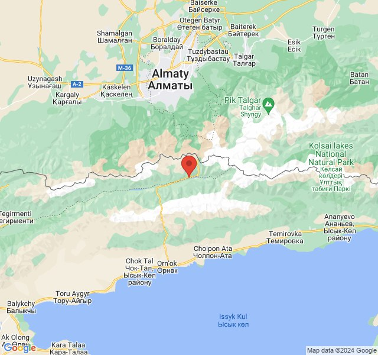
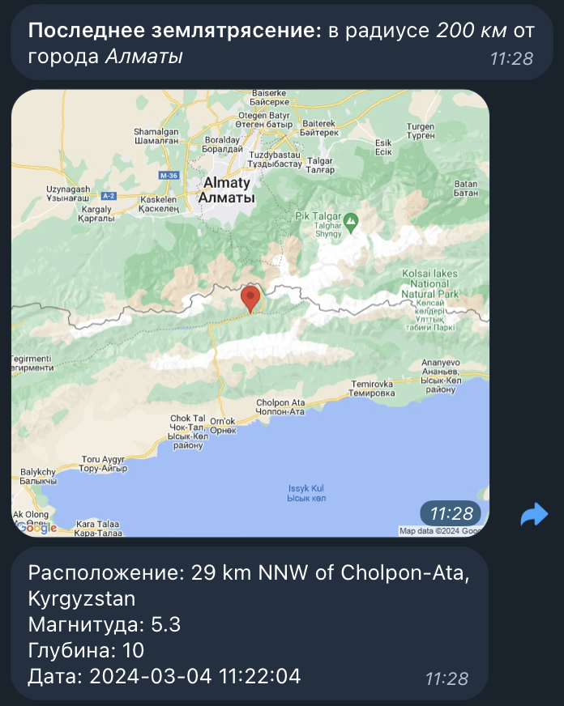

# earthquake

# Last Earthquake Telegram Bot

A bot to retrieve data on the last earthquake in the radius of a given city.

## Installation

1. Clone repository

```bash
git clone https://github.com/username/earthquake-bot.git
```

1. Install the required libraries

```bash
pip install -r requirements.txt
```

1. Make .env file from .env.example

```
TG_BOT_TOKEN=
GOOGLE_MAPS_KEY=
```

- TG_BOT_TOKEN - api key from telegram bot
- GOOGLE_MAPS_KEY - api key from google cloud console to turn map with epicenter into static png

[console.cloud.google.com](http://console.cloud.google.com/)

1. Launch the bot with the command

```bash
python3 earthquake_bot.py
```

1. Stop the bot: Ctrl+C/Command+C

## Usage

Entry point of bot is /start. The bot will ask the user about the city and the radius around it. The user can click on the button and get information about the last earthquake. The user can edit the city and radius.

## API params

The API was taken from earthquake.usgs.gov

```python
url = 'https://earthquake.usgs.gov/fdsnws/event/1/query'
params = {
        'format': 'geojson',
        'latitude': settings['latitude'],
        'longitude': settings['longitude'],
        'maxradiuskm': settings['maxradius'],
    }    
```

The user input only city and maxradius. Than entered city is passed to function “get_coordinates” which uses “geopy” library, to get coordinates of city.

## Output data

Using the latitude and longitude data of the epicenter, a png format map is obtained and sent to the user:



Then sends information about exact place of epicentre, magnitude, depth and local date.
